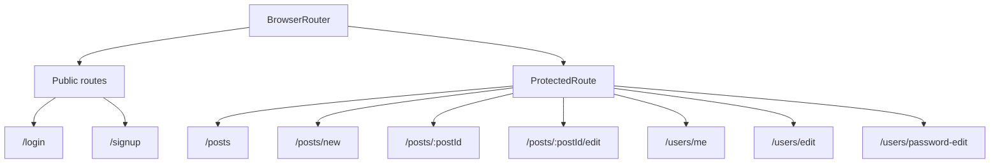
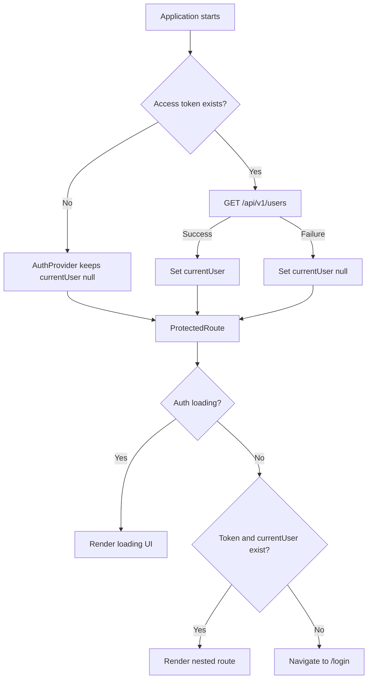
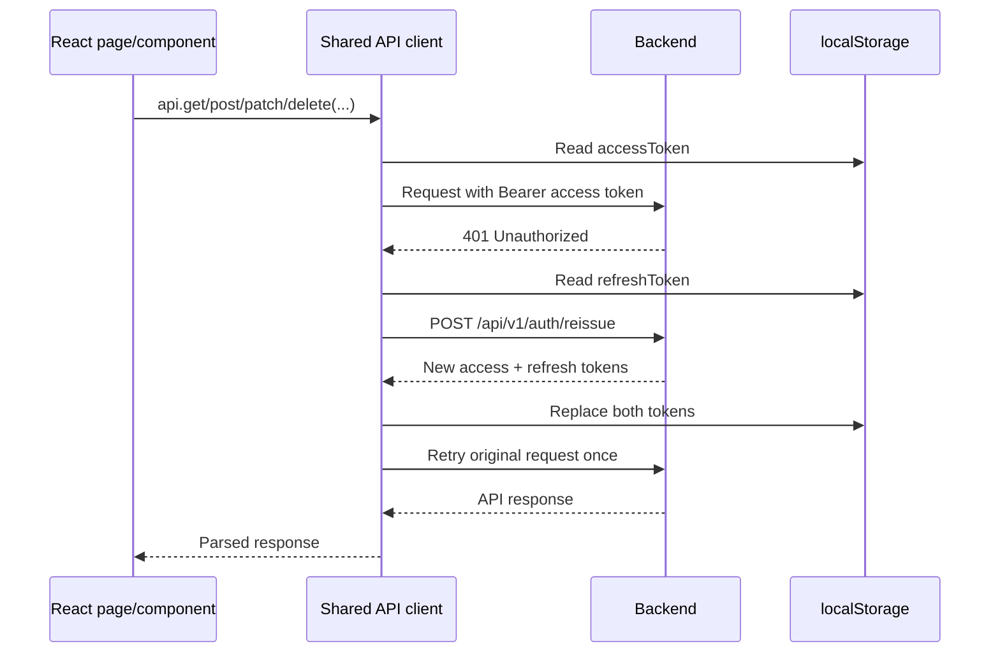
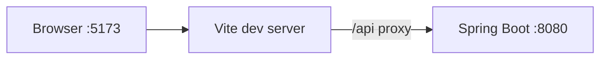
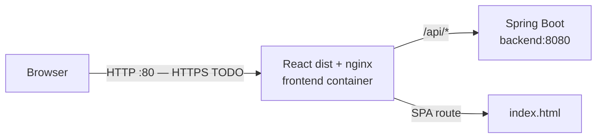

# MLB Discussion Board — Frontend

React frontend for an MLB-themed discussion board where authenticated users can browse and search posts, participate in comments, manage their profiles and favorite teams, and view MLB schedules.

The project began with separate Vanilla JavaScript pages and was migrated to a component-based React application. Authentication boundaries, API error handling, modal feedback, and deployment behavior were centralized during the migration while preserving the existing Spring Boot REST API contract.

>  [(KR ver.) README](./docs/README.ko.md)

---
## Project information

| Item                             | Details                                                                                            |
|----------------------------------|----------------------------------------------------------------------------------------------------|
| Type                             | Individual project                                                                                 |
| Project period                   | 2026-05-26 – 2026-08-09                                                                            |
| Frontend repository              | [Yonduss/discussionboard-FE](https://github.com/Yonduss/discussionboard-FE)                        |
| Backend repository               | [Yonduss/discussion-board](https://github.com/Yonduss/discussion-board)                            |
| Service video                    | [Google drive](https://drive.google.com/file/d/10yFmX8xnkVNDT6rWMpzz3QG9Sz7QH4dr/view?usp=sharing) |

---
## Main features

### Authentication and account management

- Sign-up and login forms with client-side length, format, and password-confirmation validation.
- Protected application routes based on both the access token and loaded current-user state.
- Automatic access-token reissue with one retry after an authenticated `401` response.
- Logout request followed by removal of authentication-related local storage values.
- Profile, password, and account-deletion interfaces.
- Shared loading state while the initial authenticated user is being restored.

### Posts and comments

- Infinite-scroll post list with duplicate response protection.
- Title/content search and search reset.
- Post creation and editing with ordered image URL inputs.
- Post details with author actions, images, view/like/comment counts, likes, and reporting.
- One-level comment replies, comment editing, and deletion.
- In-flight guards prevent duplicate likes, comments, and other repeated submissions.

### Profile and MLB experience

- Desktop dashboard for the current user's profile, posts, and comments.
- Paginated My Posts and My Comments lists linking back to their posts.
- Favorite-team selection for all 30 MLB teams.
- Choice between a personal profile image and the selected team's logo.
- Before/after image preview modal when changing the profile-image preference.
- Flip-card view for the favorite team's recent and upcoming games.
- Today's MLB games sidebar on the post list.
- Shared Eastern Time formatting for post, comment, and MLB schedule timestamps.

---
## Technology stack

| Area | Technologies                                                      |
| --- |-------------------------------------------------------------------|
| Language | JavaScript (ES modules), JSX                                      |
| UI | React 19.2                                                        |
| Routing | React Router DOM 7.18                                             |
| State | React Context, Hooks, local component state                       |
| Build tool | Vite 8.1                                                          |
| Styling | Plain CSS, MLB Navy `#002D72`, MLB Red `#D50032`, White `#FFFFFF` |
| API | Fetch API through a shared client module                          |
| Validation | HTML constraints and page-level validation logic                  |
| Static server / proxy | nginx                                                             |
| Container | Node 22 multi-stage Docker build, nginx Alpine runtime            |
| CI/CD | GitHub Actions, GHCR, GitHub OIDC, AWS Systems Manager            |
| Cloud runtime | AWS EC2 with backend and frontend Docker Compose services         |
| Development tools | Visual Studio Code, WebStorm, Chrome DevTools, Git, GitHub        |

---
## Vanilla JavaScript to React migration

- The `vanilla-js/` directory preserves the first frontend implementation.
- The production application is under `react-FE/`.

| Before: Vanilla JavaScript | After: React |
| --- | --- |
| Separate HTML file for each screen | Route-based single-page application |
| Manual DOM lookup and mutation | Declarative JSX rendering |
| Page-specific event registration | Component event handlers and Hooks |
| Repeated login checks inside page scripts | One `ProtectedRoute` boundary |
| Direct `window.location` navigation | React Router navigation and links |
| Repeated `fetch` and response parsing | Shared API client and `APIError` |
| Native `alert`, `confirm`, and `prompt` | Reusable queued modal components |
| Shared data through global/script state | Auth and modal Context providers |
| Page-level loading assumptions | Explicit loading, empty, error, and submitting states |

The migration focused on responsibility boundaries rather than translating each script line-by-line. Pages load only their own data, route protection owns authentication gating, the API client owns token recovery, and modal providers own application feedback.

---
## Application structure

```text
discussionboard-FE/
├── .github/workflows/
│   ├── ci.yml                       # Lint, build, image, integration smoke test
│   └── cd.yml                       # GHCR publish and OIDC/SSM deployment
├── docs/
│   ├── README.ko.md                 # Korean README
│   └── screenshots/                 # Service screenshots
├── scripts/
│   ├── deploy-frontend.sh           # EC2 frontend deployment
│   └── smoke-test.sh                # nginx-to-backend integration smoke test
├── vanilla-js/                      # Original migration source
└── react-FE/
    ├── public/team-logos/           # Build-stable MLB team logo assets
    ├── src/
    │   ├── api/                     # Shared API client and token helpers
    │   ├── components/              # Reusable UI components
    │   ├── contexts/                # Authentication and modal providers
    │   ├── data/                    # MLB team metadata and asset mapping
    │   ├── images/                  # Bundled application images
    │   ├── pages/                   # Route pages and comment presentation
    │   ├── routes/                  # ProtectedRoute
    │   ├── styles/                  # Page and shared CSS
    │   └── utils/                   # Client IDs and date/time formatting
    ├── Dockerfile                   # React build and nginx runtime stages
    ├── nginx.conf                   # SPA, API proxy, health, security headers
    ├── package.json
    └── vite.config.js               # Development API proxy
```

---
## Route structure



| Route | Page | Access | Main responsibility |
| --- | --- | --- | --- |
| `/` | Redirect | Public | Redirect to login |
| `/login` | `LoginPage` | Public | Authenticate and initialize the current user |
| `/signup` | `SignupPage` | Public | Validate and create a user account |
| `/posts` | `PostsPage` | Protected | Search and infinitely load posts; show today's games |
| `/posts/new` | `PostWritePage` | Protected | Create a post with ordered image URLs |
| `/posts/:postId` | `PostDetailPage` | Protected | View, like, report, delete, and discuss a post |
| `/posts/:postId/edit` | `PostEditPage` | Protected | Author-only post editing UI |
| `/users/me` | `MyProfilePage` | Protected | Profile dashboard, activities, team preference, schedules |
| `/users/edit` | `UserEditPage` | Protected | Profile edit and account deletion |
| `/users/password-edit` | `PasswordEditPage` | Protected | Password change and session termination |
| `*` | Redirect | Public | Redirect unknown routes to login |

---
## ProtectedRoute authentication flow



`ProtectedRoute` is the single authentication boundary for application pages. Individual protected pages do not repeat token or authentication-loading checks; they retain only resource-level checks such as whether the current user authored a post or comment.

---
## API client and JWT reissue flow

The shared client in `react-FE/src/api/api.js` handles base URLs, JSON serialization, authentication headers, response parsing, normalized errors, token reissue, and expired-session cleanup.



- `refreshPromise` provides single-flight behavior: concurrent `401` responses share one reissue request.
- The original request is retried only once to avoid an infinite refresh loop.
- Failed reissue clears only `accessToken` and `refreshToken`, then redirects to `/login`.
- API failures are represented by `APIError` with `message`, HTTP `status`, and parsed `body`.
- `VITE_API_BASE_URL` is optional; an empty value keeps requests same-origin.

The current browser storage strategy is an explicit project tradeoff. Moving the refresh token to a Secure, HttpOnly, SameSite cookie is listed as a future security improvement.

---
## Page-level implementation

| Page | Implemented behavior |
| --- | --- |
| Login | Validation, authentication, token storage, user restoration, modal errors |
| Sign Up | Email/password/nickname validation, password match, image URL preview |
| Posts | Search, reset, infinite scroll, deduplication, loading/empty/end states, Today’s Games sidebar |
| Create / Edit Post | Title/content validation, dynamic image URL rows, order changes, submission guards |
| Post Detail | Author actions, images, likes, views, report modal, comment thread |
| My Profile | Profile summary, favorite team, image source, recent/upcoming games, paginated activities |
| Edit Profile | Profile preview, nickname and URL editing, account deletion confirmation |
| Change Password | Current/new password validation, confirmation, token cleanup after success |

---
## Main reusable components

| Component | Responsibility |
| --- | --- |
| `Header` | MLB branding, current profile image, account menu, logout |
| `PostCard` | List summary with author, timestamp, likes, views, and comments |
| `ImageUrlInputs` | Add, remove, reorder, and edit post image URL inputs |
| `CommentForm` | New-comment input and submitting state |
| `TextInputModal` | Reply, comment edit, and post-report text input |
| `MessageModal` | Success, information, and error feedback |
| `ConfirmModal` | Destructive-action confirmation |
| `ModalProvider` | Promise-based message/confirm queue and dialog lifecycle |
| `ProfileImageChoiceModal` | Personal-image versus team-logo preview and selection |
| `FavoriteTeamGamesCard` | Recent/upcoming game flip card with loading/error/empty states |
| `TodayGamesSidebar` | MLB-date schedule, team logos, Eastern Time, and live state |
| `UserEditForm` | Shared profile edit and account deletion behavior |

---
## UX improvements

- Replaced native `alert`, `confirm`, and `prompt` dialogs with a consistent modal system.
- Queued global feedback prevents simultaneous messages from overwriting each other.
- Dialogs support Escape/cancel handling, backdrop interaction, ARIA relationships, and initial focus.
- Added loading, refreshing, empty, error, end-of-list, and retry states where applicable.
- Disabled buttons during likes, logout, comments, destructive actions, and form submissions.
- Prevented duplicate post entries while appending infinite-scroll pages.
- Preserved authored-resource checks while centralizing login checks in `ProtectedRoute`.
- Added before/after profile-image previews before changing team-logo preferences.
- Served team logos from `public/team-logos` so production builds keep stable asset paths.
- Centralized date/time formatting and standardized display to MLB Eastern Time.
- Applied a consistent MLB-derived visual palette and card styling.

---
## Runtime architecture

### Development



Vite proxies `/api` to `http://localhost:8080`, so `VITE_API_BASE_URL` can remain unset for the standard local setup.

### Production



The production image uses two stages:

1. Node 22 Alpine installs dependencies with `npm ci` and creates the Vite `dist` bundle.
2. nginx Alpine serves the bundle and proxies `/api/` to the backend Compose service.

nginx also provides:

- SPA fallback with `try_files ... /index.html`.
- A static `/health` endpoint.
- Dynamic Docker DNS resolution for a replaced backend container.
- `X-Content-Type-Options`, `X-Frame-Options`, `Referrer-Policy`, `Permissions-Policy`, and Content Security Policy headers.

These headers do not replace transport security. A domain, TLS certificate, and HTTP-to-HTTPS redirect remain required.

---
## Environment variables

| Variable | Required | Description |
| --- | --- | --- |
| `VITE_API_BASE_URL` | No | API origin embedded at build time; defaults to same-origin |

Standard development requires no frontend `.env` because Vite proxies `/api` to the local backend.

Example only when the API must use a different origin:

```ini
VITE_API_BASE_URL=http://localhost:8080
```

Do not place secrets in `VITE_*` variables. Vite embeds them in the browser bundle.

---
## Development and build

Prerequisites:

- Node.js 22
- npm
- Backend running at `http://localhost:8080` for API functionality

Install and start the Vite development server:

```bash
cd react-FE
npm ci
npm run dev
```

Open `http://localhost:5173`.

Run lint and create a production build:

```bash
npm run lint
npm run build
```

Preview the generated Vite bundle:

```bash
npm run preview
```

The complete application can also be started from the backend repository's Compose file:

```bash
cd /path/to/discussionboard
docker compose up -d --build --wait
docker compose ps
```

The Compose path is recommended for verifying nginx, Spring Boot, MySQL, and the same-origin `/api` route together.

---
## CI pipeline

Frontend CI runs on pushes and pull requests to `main`:

1. Installs dependencies with Node.js 22 and `npm ci`.
2. Runs ESLint with `npm run lint`.
3. Builds the Vite production bundle with `npm run build`.
4. Builds the multi-stage frontend Docker image.
5. Checks out the backend repository and starts the full application through Docker Compose.
6. Calls sign-up, login, and authenticated post-list APIs through nginx.
7. Verifies that an unauthenticated `/api/v1/posts` request returns backend `401` JSON rather than SPA HTML.

The current frontend does not yet have a component/unit test framework. Lint, production build, Docker build, and cross-repository smoke testing form the present CI gate.

---
## CD and AWS deployment

A successful CI run on `main` triggers the frontend CD workflow. Manual deployment requires a full commit SHA that belongs to `main` and has already passed CI.

The workflow:

1. Builds and publishes immutable `<commit-SHA>` and convenience `latest` images to GHCR.
2. Obtains short-lived AWS credentials through GitHub OIDC.
3. Sends the deployment command to EC2 through AWS Systems Manager instead of SSH.
4. Updates only `FRONTEND_IMAGE_TAG` in `/opt/discussionboard/.env`.
5. Pulls and replaces only the frontend Compose service.
6. Verifies the nginx `/health` endpoint.
7. Confirms `/api/v1/posts` returns backend `401` JSON through the deployed nginx proxy.

The production GitHub Environment requires:

- `AWS_ROLE_ARN`
- `AWS_REGION`
- `EC2_INSTANCE_ID`

The deployment assumes `/opt/discussionboard/docker-compose.prod.yml` and `/opt/discussionboard/.env` already exist on EC2. The backend repository owns the shared production Compose definition.

---
## Service screenshots

<table>
  <tr>
    <th>Login</th>
    <th>Sign Up</th>
  </tr>
  <tr>
    <td></td>
    <td></td>
  </tr>
  <tr>
    <th>Post List and Today’s Games</th>
    <th>Post Detail and Comments</th>
  </tr>
  <tr>
    <td></td>
    <td></td>
  </tr>
  <tr>
    <th>Create / Edit Post</th>
    <th>Reply / Edit / Report Modal</th>
  </tr>
  <tr>
    <td></td>
    <td></td>
  </tr>
  <tr>
    <th>My Profile Dashboard</th>
    <th>Favorite Team Image Preference</th>
  </tr>
  <tr>
    <td></td>
    <td></td>
  </tr>
  <tr>
    <th>Edit Profile</th>
    <th>Change Password</th>
  </tr>
  <tr>
    <td></td>
    <td></td>
  </tr>
</table>

---
## Known limitations and future improvements

- Add a domain, TLS certificate, and HTTP-to-HTTPS redirect.
- Move refresh-token storage from `localStorage` to a Secure, HttpOnly, SameSite cookie design with an appropriate CSRF policy.
- Add React Testing Library component tests and Playwright end-to-end tests.
- Add responsive layouts; the current UI intentionally targets desktop screens.
- Replace image URL inputs with an upload flow backed by object storage such as S3.
- Add a full keyboard and screen-reader accessibility audit.
- Add user-selectable time zones if the current MLB Eastern Time display policy changes.
- Add stale-data or retry UX for longer MLB API outages.

---
## Retrospective

Migrating the frontend from Vanilla JavaScript to React showed me the practical value of separating responsibilities. Moving repeated authentication checks into `ProtectedRoute` and centralizing API requests, token reissue, and modal feedback allowed each page to focus on its own data and UI state while making the overall flow easier to follow.

Packaging the Vite build with nginx and connecting the frontend CI/CD pipeline to the real backend also changed how I viewed frontend work. A successful static build alone was not enough; the deployed SPA fallback, `/api` proxy, authentication response, health check, and container replacement behavior all needed to be verified together.
