# MLB Discussion Board — Frontend

인증된 사용자가 게시글을 조회하고 검색하며, 댓글에 참여하고, 프로필과 응원 팀을 관리하고, MLB 경기 일정을 확인할 수 있는 MLB 테마 게시판의 React 프론트엔드입니다.

이 프로젝트는 페이지별 Vanilla JavaScript 애플리케이션으로 시작하여 컴포넌트 기반 React 애플리케이션으로 마이그레이션되었습니다. 기존 Spring Boot REST API 명세를 유지하면서 인증 경계, API 오류 처리, modal 피드백, 배포 동작을 중앙화했습니다.

> [(EN ver.) README](../README.md)

---
## 프로젝트 정보

| 항목          | 내용 |
|---------------| --- |
| 프로젝트 유형 | 개인 프로젝트 |
| 프로젝트 기간 | 2026-05-26 – 2026-08-09 |
| 프론트엔드    | [Yonduss/discussionboard-FE](https://github.com/Yonduss/discussionboard-FE) |
| 백엔드        | [Yonduss/discussion-board](https://github.com/Yonduss/discussion-board) |
| 서비스 영상   | [Google drive](https://drive.google.com/file/d/10yFmX8xnkVNDT6rWMpzz3QG9Sz7QH4dr/view?usp=sharing) |

---
## 주요 기능

### 인증 및 계정 관리

- 길이, 형식 및 비밀번호 일치 여부를 client에서 검증하는 회원가입·로그인 form
- 액세스 토큰과 현재 사용자 로딩 결과를 함께 확인하는 보호 route
- 인증된 요청이 `401`을 반환하면 액세스 토큰을 자동 재발급하고 한 번 재요청
- 서버 로그아웃 요청 후 인증 관련 local storage 값만 제거
- 프로필, 비밀번호 변경 및 회원 탈퇴 화면
- 초기 인증 사용자 복원 중 공유 loading 상태 제공

### 게시글 및 댓글

- 중복 응답 방지를 적용한 게시글 무한 스크롤
- 제목·내용 검색 및 검색 초기화
- 순서를 변경할 수 있는 이미지 URL 입력을 포함한 게시글 작성·수정
- 작성자 기능, 이미지, 조회·좋아요·댓글 수, 좋아요 및 신고를 제공하는 게시글 상세 화면
- 한 단계 댓글 답글, 댓글 수정 및 삭제
- 좋아요, 댓글 등 요청 중 중복 제출을 방지하는 상태 제어

### 프로필 및 MLB 기능

- 현재 사용자의 프로필, 게시글 및 댓글을 제공하는 데스크톱 dashboard
- 해당 게시글로 이동할 수 있는 페이지네이션 기반 My Posts 및 My Comments
- MLB 30개 팀 중 응원 팀 선택 가능
- 개인 프로필 이미지와 선택한 팀 로고 중 프로필 이미지 선택 가능
- 프로필 이미지 설정 변경 전 기존·변경 이미지 비교 modal
- 응원 팀의 최근·예정 경기를 전환하는 flip card
- 게시글 목록의 오늘 MLB 경기 sidebar
- 게시글, 댓글 및 MLB 일정을 미국 동부 시간으로 표시하는 공통 formatter

---
## 기술 스택

| 구분 | 기술                                                              |
| --- |-------------------------------------------------------------------|
| 언어 | JavaScript (ES modules), JSX                                      |
| UI | React 19.2                                                        |
| Routing | React Router DOM 7.18                                             |
| 상태 관리 | React Context, Hooks, local component state                       |
| 빌드 도구 | Vite 8.1                                                          |
| 스타일 | Plain CSS, MLB Navy `#002D72`, MLB Red `#D50032`, White `#FFFFFF` |
| API | 공통 client module을 통한 Fetch API                               |
| 검증 | HTML constraint 및 page-level validation logic                    |
| 정적 서버·프록시 | nginx                                                             |
| 컨테이너 | Node 22 멀티 스테이지 Docker build, nginx Alpine runtime          |
| CI/CD | GitHub Actions, GHCR, GitHub OIDC, AWS Systems Manager            |
| 클라우드 실행 환경 | 백엔드·프론트엔드 Docker Compose service를 실행하는 AWS EC2       |
| 개발 도구 | Visual Studio Code, WebStorm, Chrome DevTools, Git, GitHub        |

---
## Vanilla JavaScript에서 React로 마이그레이션

`vanilla-js/` 디렉터리에는 최초 프론트엔드 구현을 보존했으며, 현재 애플리케이션은 `react-FE/`에 있습니다.

| 이전: Vanilla JavaScript | 이후: React |
| --- | --- |
| 화면별 HTML 파일 | Route 기반 Single Page Application |
| 직접 DOM 조회 및 변경 | 선언형 JSX rendering |
| 페이지별 event 등록 | Component event handler 및 Hook |
| 페이지 script마다 반복되는 로그인 확인 | 단일 `ProtectedRoute` 경계 |
| `window.location`을 통한 직접 이동 | React Router navigation 및 Link |
| 반복되는 `fetch`와 응답 parsing | 공통 API client 및 `APIError` |
| Native `alert`, `confirm`, `prompt` | 재사용 가능한 queue 기반 modal component |
| 전역·script 상태를 통한 데이터 공유 | Auth 및 Modal Context provider |
| 페이지별 암묵적인 loading 처리 | 명시적인 loading, empty, error, submitting 상태 |

Migration은 기존 script를 한 줄씩 변환하는 대신 책임을 분리하는 데 집중했습니다. 페이지는 자신에게 필요한 데이터만 불러오고, route protection은 인증 진입을 담당하며, API client는 토큰 복구를, modal provider는 사용자 피드백을 담당합니다.

---
## 애플리케이션 구조

```text
discussionboard-FE/
├── .github/workflows/
│   ├── ci.yml                       # Lint, build, image, 통합 smoke test
│   └── cd.yml                       # GHCR publish 및 OIDC/SSM 배포
├── docs/
│   ├── README.ko.md                 # 한국어 README
│   └── screenshots/                 # 서비스 화면 캡처
├── scripts/
│   ├── deploy-frontend.sh           # EC2 프론트엔드 배포
│   └── smoke-test.sh                # nginx-to-backend 통합 smoke test
├── vanilla-js/                      # React migration 이전 구현
└── react-FE/
    ├── public/team-logos/           # 빌드 후에도 경로가 유지되는 MLB 팀 로고
    ├── src/
    │   ├── api/                     # 공통 API client 및 토큰 helper
    │   ├── components/              # 재사용 UI component
    │   ├── contexts/                # 인증 및 modal provider
    │   ├── data/                    # MLB 팀 정보 및 asset mapping
    │   ├── images/                  # 번들에 포함되는 애플리케이션 이미지
    │   ├── pages/                   # Route page 및 댓글 표시
    │   ├── routes/                  # ProtectedRoute
    │   ├── styles/                  # 페이지·공통 CSS
    │   └── utils/                   # Client ID 및 날짜·시간 formatter
    ├── Dockerfile                   # React build 및 nginx runtime stage
    ├── nginx.conf                   # SPA, API proxy, health, security header
    ├── package.json
    └── vite.config.js               # 개발 환경 API proxy
```

---
## Route 구조

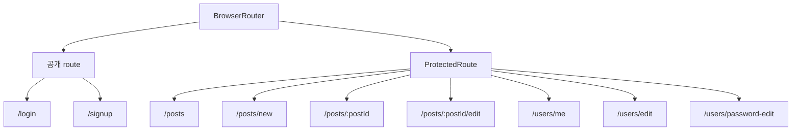

| Route | Page | 접근 | 주요 역할 |
| --- | --- | --- | --- |
| `/` | Redirect | 공개 | 로그인으로 이동 |
| `/login` | `LoginPage` | 공개 | 인증 및 현재 사용자 초기화 |
| `/signup` | `SignupPage` | 공개 | 입력값 검증 및 계정 생성 |
| `/posts` | `PostsPage` | 보호 | 게시글 검색·무한 로딩 및 오늘 경기 표시 |
| `/posts/new` | `PostWritePage` | 보호 | 이미지 URL 순서를 포함한 게시글 작성 |
| `/posts/:postId` | `PostDetailPage` | 보호 | 게시글 조회, 좋아요, 신고, 삭제 및 댓글 |
| `/posts/:postId/edit` | `PostEditPage` | 보호 | 작성자 전용 게시글 수정 UI |
| `/users/me` | `MyProfilePage` | 보호 | 프로필 dashboard, 활동, 응원 팀 및 일정 |
| `/users/edit` | `UserEditPage` | 보호 | 프로필 수정 및 회원 탈퇴 |
| `/users/password-edit` | `PasswordEditPage` | 보호 | 비밀번호 변경 및 session 종료 |
| `*` | Redirect | 공개 | 알 수 없는 route를 로그인으로 이동 |

---
## ProtectedRoute 인증 흐름

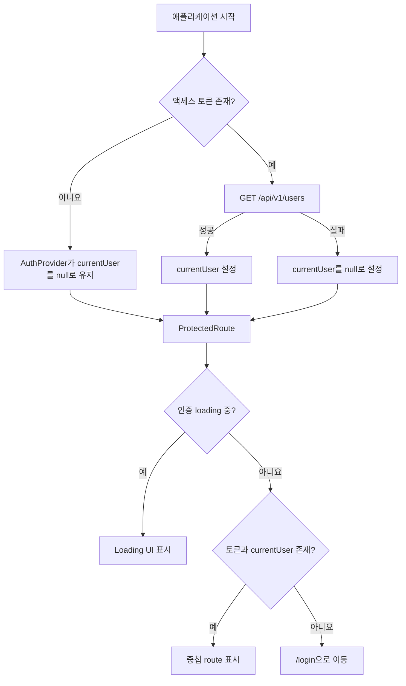

`ProtectedRoute`는 애플리케이션 페이지의 단일 인증 경계입니다. 보호된 각 페이지는 토큰 또는 인증 loading 확인을 반복하지 않고, 현재 사용자가 게시글·댓글 작성자인지와 같은 resource-level 권한 확인만 유지합니다.

---
## API client 및 JWT 재발급 흐름

`react-FE/src/api/api.js`의 공통 client는 base URL, JSON 직렬화, 인증 header, 응답 parsing, 정규화된 오류, 토큰 재발급 및 만료 session 정리를 담당합니다.

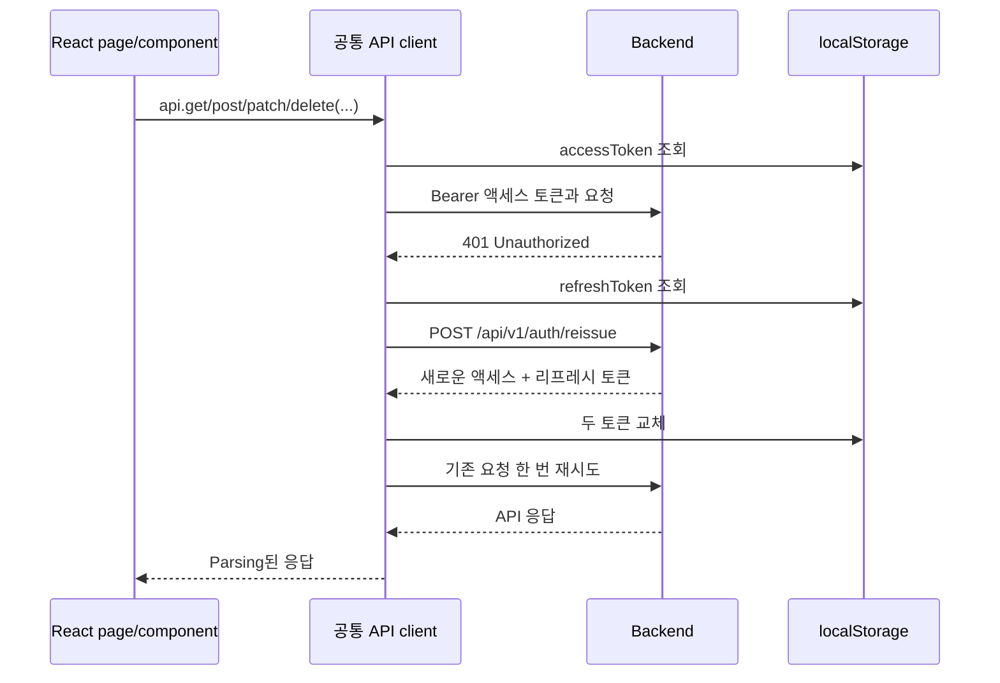

- `refreshPromise`는 single-flight 방식으로 동작하여 동시에 발생한 여러 `401` 응답이 하나의 재발급 요청 공유
- 무한 재발급을 방지하기 위해 기존 요청은 한 번만 재시도
- 재발급이 실패하면 `accessToken`과 `refreshToken`만 삭제한 뒤 `/login`으로 이동
- API 오류는 `message`, HTTP `status`, parsing된 `body`를 가진 `APIError`로 표현
- `VITE_API_BASE_URL`은 선택 항목이며, 빈 값이면 same-origin 요청 사용

현재 브라우저 저장 방식은 프로젝트에서 명시적으로 선택한 tradeoff입니다. 리프레시 토큰을 Secure, HttpOnly, SameSite cookie로 옮기는 작업을 향후 보안 개선 항목으로 남겼습니다.

---
## 페이지별 구현

| 페이지 | 구현 내용 |
| --- | --- |
| Login | 검증, 인증, 토큰 저장, 사용자 복원 및 modal 오류 |
| Sign Up | 이메일·비밀번호·닉네임 검증, 비밀번호 일치 및 이미지 URL preview |
| Posts | 검색, 초기화, 무한 스크롤, 중복 제거, loading/empty/end 상태 및 Today’s Games sidebar |
| Create / Edit Post | 제목·내용 검증, 동적 이미지 URL 행, 순서 변경 및 제출 중복 방지 |
| Post Detail | 작성자 기능, 이미지, 좋아요, 조회수, 신고 modal 및 댓글 thread |
| My Profile | 프로필 요약, 응원 팀, 이미지 출처, 최근·예정 경기 및 페이지네이션 활동 목록 |
| Edit Profile | 프로필 preview, 닉네임·URL 수정 및 회원 탈퇴 확인 |
| Change Password | 현재·새 비밀번호 검증, 비밀번호 확인 및 성공 후 토큰 제거 |

---
## 주요 재사용 컴포넌트

| Component | 역할                                                            |
| --- |-----------------------------------------------------------------|
| `Header` | MLB branding, 현재 프로필 이미지, 계정 menu 및 로그아웃         |
| `PostCard` | 작성자, 작성 시각, 좋아요, 조회수 및 댓글 수를 포함한 목록 요약 |
| `ImageUrlInputs` | 게시글 이미지 URL 입력 추가·삭제·순서 변경·수정                 |
| `CommentForm` | 새 댓글 입력 및 제출 상태                                       |
| `TextInputModal` | 답글, 댓글 수정 및 게시글 신고 text input                       |
| `MessageModal` | 성공, 정보 및 오류 피드백                                       |
| `ConfirmModal` | 확인 여부 필요 작업                                             |
| `ModalProvider` | Promise 기반 message/confirm queue 및 dialog lifecycle          |
| `ProfileImageChoiceModal` | 개인 이미지와 팀 로고 preview 및 선택                           |
| `FavoriteTeamGamesCard` | loading/error/empty 상태를 포함한 최근·예정 경기 flip card      |
| `TodayGamesSidebar` | MLB 날짜 일정, 팀 로고, 미국 동부 시간 및 LIVE 상태             |
| `UserEditForm` | 프로필 수정 및 회원 탈퇴 공통 동작                              |

---
## UX 개선

- Native `alert`, `confirm`, `prompt`를 일관된 modal system으로 교체
- 전역 feedback queue로 여러 message가 동시에 서로를 덮어쓰지 않게 함
- Dialog에 Escape/cancel, backdrop interaction, ARIA 관계 및 initial focus 적용
- 필요한 화면에 loading, refreshing, empty, error, end-of-list 및 retry 상태 추가
- 좋아요, 로그아웃, 댓글, 파괴적 작업 및 form 제출 중 button 비활성화
- 무한 스크롤 page를 추가할 때 중복 게시글이 들어오지 않도록 처리
- 로그인 확인은 `ProtectedRoute`에 중앙화하면서 작성자 resource 확인 유지
- 팀 로고 설정을 바꾸기 전에 기존·변경 프로필 이미지 비교 가능
- 운영 build에서도 안정적인 asset 경로를 유지하도록 팀 로고를 `public/team-logos`에서 제공
- 날짜·시간 formatter를 중앙화하고 MLB 미국 동부 시간으로 표시 통일
- MLB 색상을 기반으로 일관된 palette와 card 스타일 적용

---
## 실행 환경 아키텍처

### 개발 환경

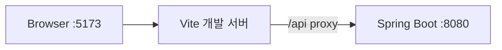

Vite는 `/api`를 `http://localhost:8080`으로 proxy하므로 일반적인 로컬 구성에서는 `VITE_API_BASE_URL`을 설정하지 않아도 됩니다.

### 운영 환경

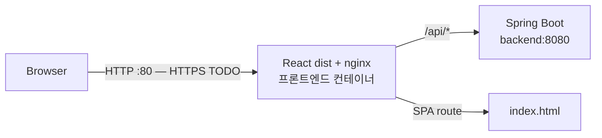

운영 이미지는 두 단계로 구성됩니다.

1. Node 22 Alpine에서 `npm ci`로 dependency를 설치하고 Vite `dist` bundle 생성
2. nginx Alpine에서 bundle을 제공하고 `/api/`를 백엔드 Compose service로 proxy함

nginx는 다음 기능들을 제공합니다.

- `try_files ... /index.html`을 사용한 SPA fallback
- 정적 `/health` endpoint
- 교체된 백엔드 컨테이너를 다시 찾기 위한 동적 Docker DNS resolution
- `X-Content-Type-Options`, `X-Frame-Options`, `Referrer-Policy`, `Permissions-Policy` 및 Content Security Policy header

현재 header는 전송 구간 보안을 대신하지 않아 도메인, TLS 인증서 및 HTTP-to-HTTPS redirect가 필요합니다.

---
## 환경변수

| 변수 | 필수 | 설명 |
| --- | --- | --- |
| `VITE_API_BASE_URL` | 아니요 | Build 시 browser bundle에 포함되는 API origin, 기본값 same-origin |

표준 개발 환경에서는 Vite가 `/api`를 로컬 백엔드로 proxy하므로 프론트엔드 `.env`가 필요하지 않습니다.

API가 다른 origin을 사용해야 할 때만 다음과 같이 설정합니다.

```ini
VITE_API_BASE_URL=http://localhost:8080
```

`VITE_*` 변수에 secret을 넣지 마세요. Vite는 해당 값을 browser bundle에 포함합니다.

---
## 개발 및 빌드

사전 요구사항:

- Node.js 22
- npm
- API 기능을 확인하려면 `http://localhost:8080`에서 실행 중인 백엔드

Dependency 설치 및 Vite 개발 서버 실행:

```bash
cd react-FE
npm ci
npm run dev
```

`http://localhost:5173`에 접속

Lint 및 운영 build 생성:

```bash
npm run lint
npm run build
```

생성된 Vite bundle preview:

```bash
npm run preview
```

백엔드 저장소의 Compose 파일로 전체 애플리케이션을 실행할 수도 있습니다.

```bash
cd /path/to/discussionboard
docker compose up -d --build --wait
docker compose ps
```

nginx, Spring Boot, MySQL 및 same-origin `/api` 경로를 함께 검증하려면 Compose 실행 방식을 권장합니다.

---
## CI 파이프라인

프론트엔드 CI는 `main`을 대상으로 하는 push 및 pull request에서 실행됩니다.

1. Node.js 22와 `npm ci`로 dependency 설치
2. `npm run lint`로 ESLint 실행
3. `npm run build`로 Vite 운영 bundle 빌드
4. 멀티 스테이지 프론트엔드 Docker 이미지 빌드
5. 백엔드 저장소를 checkout하고 Docker Compose로 전체 애플리케이션 실행
6. nginx를 통해 회원가입, 로그인 및 인증된 게시글 목록 API 호출
7. 미인증 `/api/v1/posts` 요청이 SPA HTML이 아닌 백엔드 `401` JSON을 반환하는지 검증

현재 프론트엔드에는 component/unit test framework가 없고 Lint, 운영 build, Docker build 및 저장소 간 smoke test가 현재 CI gate를 구성합니다.

---
## CD 및 AWS 배포

`main`의 CI가 성공하면 프론트엔드 CD workflow가 실행됩니다. 수동 배포에는 `main`에 포함되어 있고 CI를 통과한 전체 commit SHA가 필요합니다.

Workflow 동작:

1. 변경할 수 없는 `<commit-SHA>` 태그와 편의를 위한 `latest` 이미지를 빌드해 GHCR에 publish
2. GitHub OIDC를 통해 단기 AWS 자격 증명 발급
3. SSH 대신 AWS Systems Manager를 통해 EC2에 배포 명령 전달
4. `/opt/discussionboard/.env`의 `FRONTEND_IMAGE_TAG`만 갱신
5. 프론트엔드 Compose service만 pull하고 교체
6. nginx `/health` endpoint 검증
7. 배포된 nginx proxy를 통해 `/api/v1/posts`가 백엔드 `401` JSON을 반환하는지 확인

운영 GitHub Environment에 필요한 secret:

- `AWS_ROLE_ARN`
- `AWS_REGION`
- `EC2_INSTANCE_ID`

배포는 EC2에 `/opt/discussionboard/docker-compose.prod.yml`과 `/opt/discussionboard/.env`가 이미 존재한다고 가정합니다. 공유 운영 Compose 정의는 백엔드 저장소에서 관리합니다.

---
## 서비스 화면

<table>
  <tr>
    <th>로그인</th>
    <th>회원가입</th>
  </tr>
  <tr>
    <td>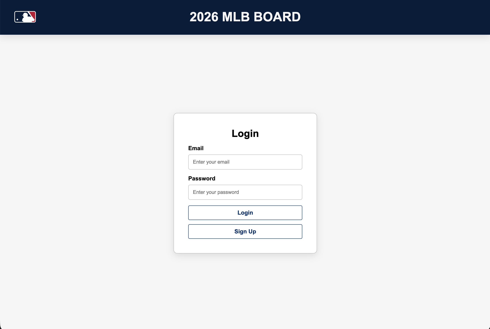</td>
    <td>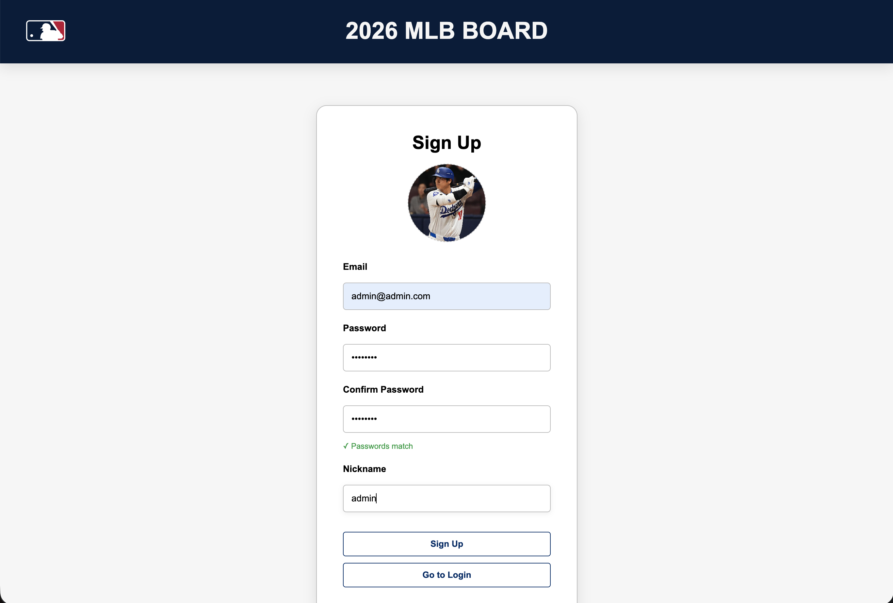</td>
  </tr>
  <tr>
    <th>게시글 목록 및 오늘 경기</th>
    <th>게시글 상세 및 댓글</th>
  </tr>
  <tr>
    <td>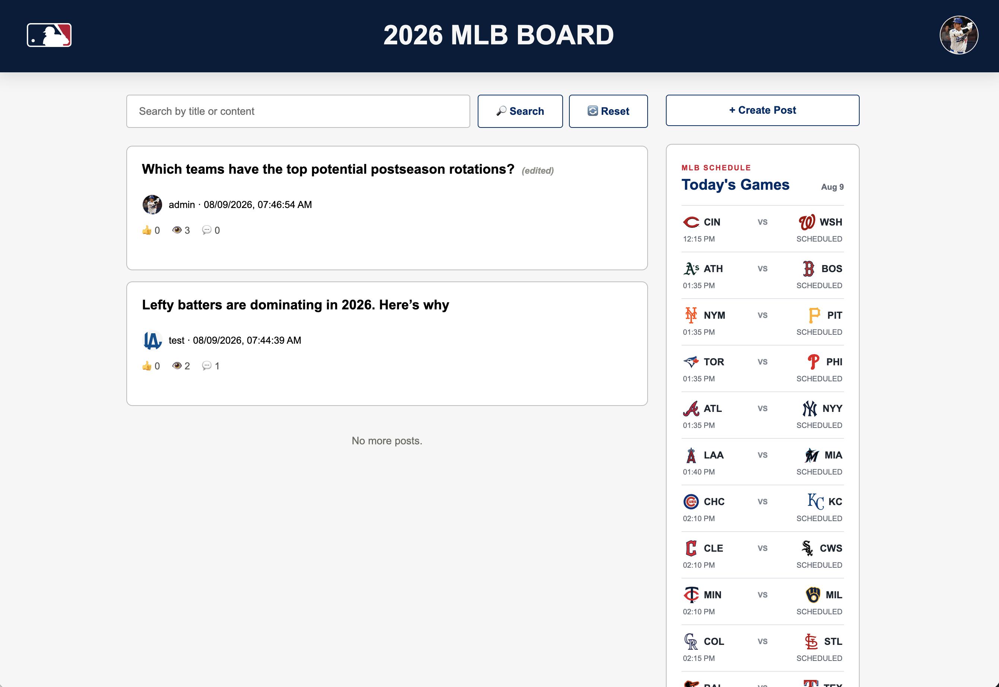</td>
    <td>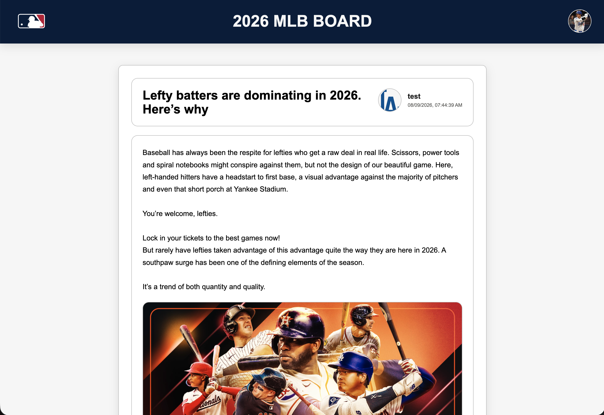</td>
  </tr>
  <tr>
    <th>게시글 작성 / 수정</th>
    <th>답글 / 수정 / 신고 Modal</th>
  </tr>
  <tr>
    <td>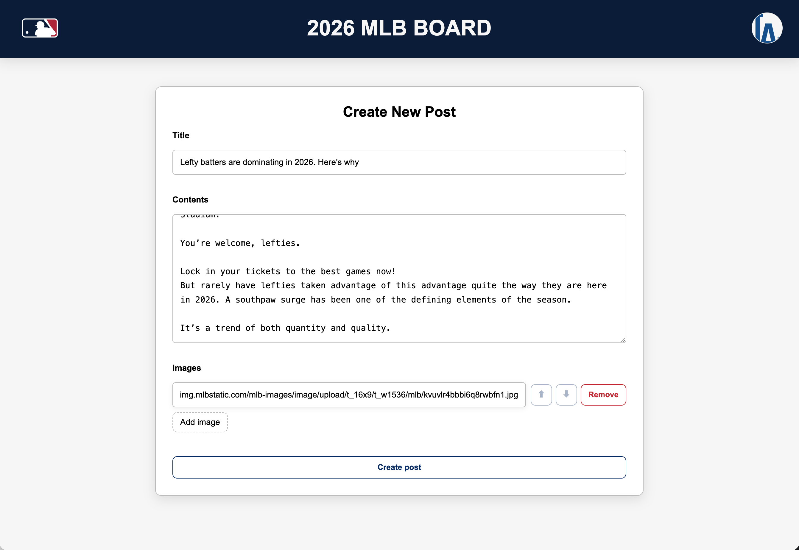</td>
    <td>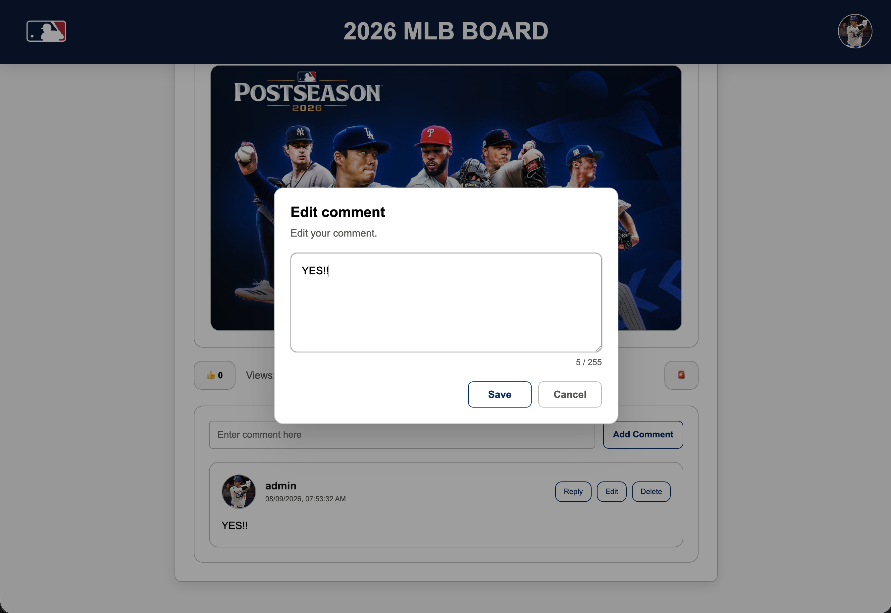</td>
  </tr>
  <tr>
    <th>My Profile Dashboard</th>
    <th>응원 팀 프로필 이미지 설정</th>
  </tr>
  <tr>
    <td>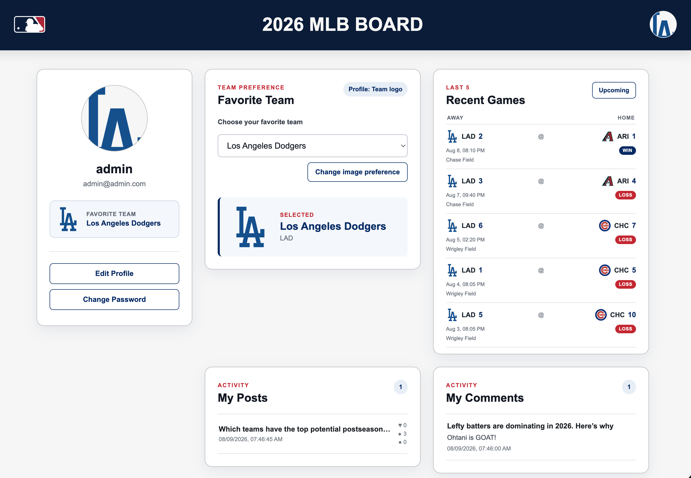</td>
    <td>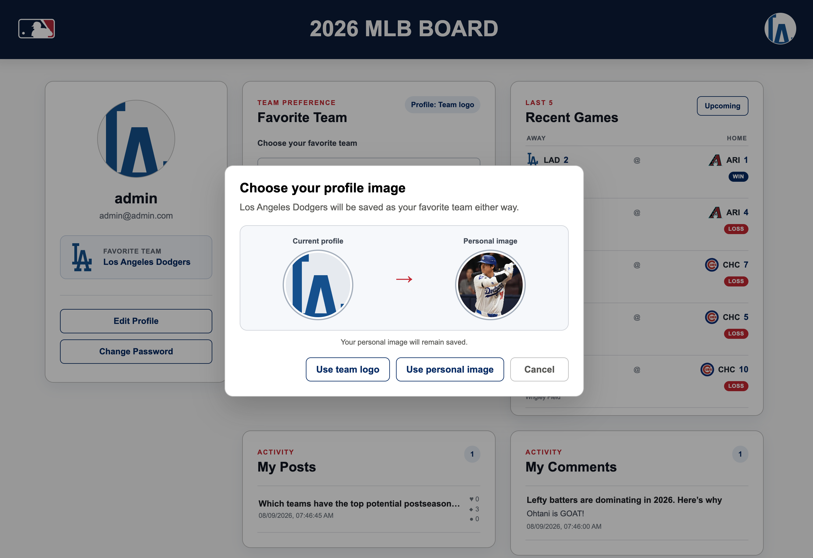</td>
  </tr>
  <tr>
    <th>프로필 수정</th>
    <th>비밀번호 변경</th>
  </tr>
  <tr>
    <td>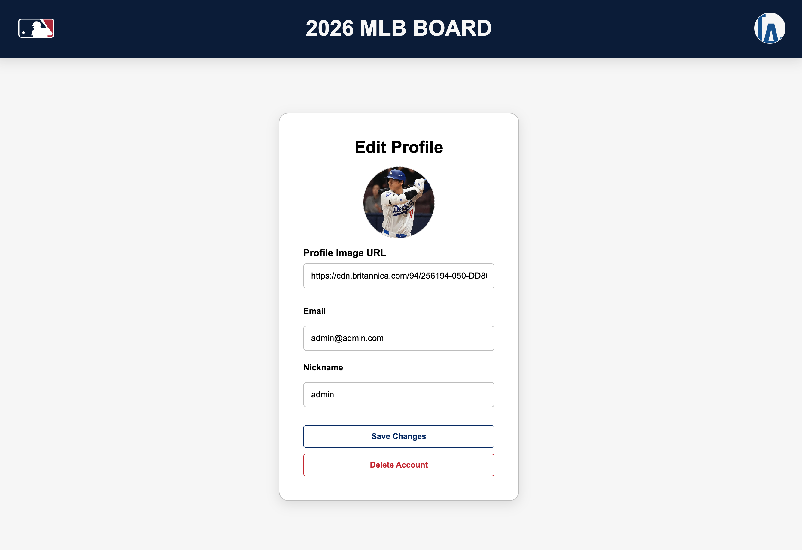</td>
    <td>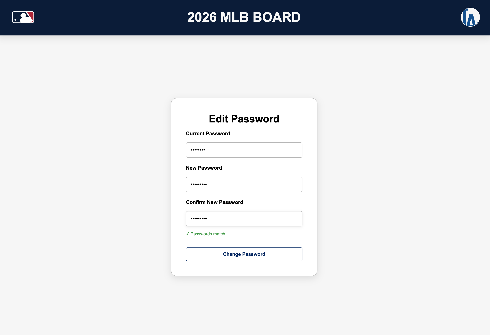</td>
  </tr>
</table>

---
## 제한사항 및 향후 개선

- 도메인, TLS 인증서 및 HTTP-to-HTTPS redirect 추가
- 리프레시 토큰 저장 위치를 `localStorage`에서 적절한 CSRF 정책을 포함한 Secure, HttpOnly, SameSite cookie 구조로 변경
- React Testing Library component test와 Playwright end-to-end test 추가
- Responsive layout 추가 (현재 UI는 의도적으로 데스크톱 화면 대상)
- 이미지 URL 입력을 S3 같은 object storage 기반 upload 방식으로 교체
- 키보드 및 screen reader 접근성 전체 검사 수행
- 현재 MLB 미국 동부 시간 표시 정책이 변경되면 사용자가 시간대를 가능하게 옵션 제공
- 장시간 MLB API 장애에 대응할 stale data 또는 retry UX 추가

---
## 회고

프론트엔드를 Vanilla JavaScript에서 React로 마이그레이션하면서 책임 분리의 효과를 실제로 경험했습니다. 반복되던 인증 확인을 `ProtectedRoute`로 옮기고 API 요청, 토큰 재발급 및 modal 피드백을 공통화하면서 각 페이지가 자신의 데이터와 UI 상태에 집중할 수 있게 되었고 전체 흐름도 더 이해하기 쉬워졌습니다.

Vite build를 nginx로 제공하고 프론트엔드 CI/CD를 실제 백엔드와 연결하면서 프론트엔드 작업을 보는 관점도 달라졌습니다. 정적 build의 성공만으로는 충분하지 않았으며, 배포된 SPA fallback, `/api` proxy, 인증 응답, health check 및 컨테이너 교체 동작을 함께 검증해야 한다는 점을 배웠습니다.